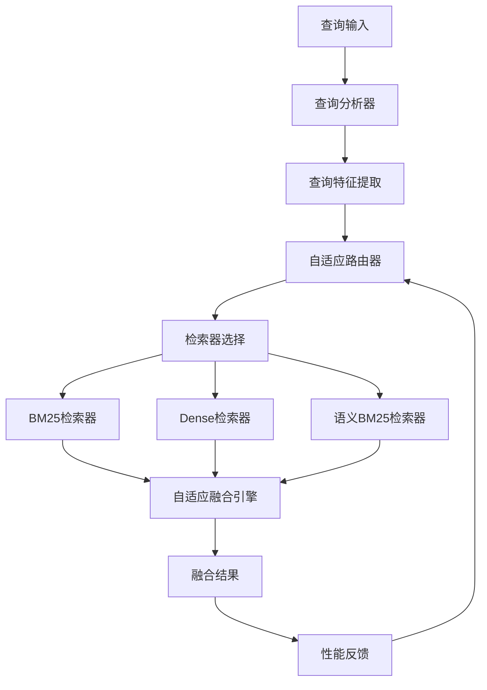

# AAAI论文发表设计文档

## 概述

基于FusionRAG项目的现有多检索器融合架构，在云服务器环境(24GB 4090 + 本地模型)上完成AAAI论文的实验设计、结果分析和论文撰写，确保在2025年1月25日截止日期前完成投稿。

## 技术架构

### 系统核心组件

### 核心创新点

1. **自适应查询路由**: 基于查询特征智能选择检索器组合
2. **动态权重融合**: 根据查询类型和历史性能调整融合权重
3. **端到端优化**: 查询分析、路由选择、结果融合的联合优化

## 实验设计

### 数据集和评估

- **数据集**: 6个BEIR数据集 (nfcorpus, scifact, fiqa, arguana, quora, scidocs)
- **评估指标**: Precision@5/10, Recall@5/10, MRR, NDCG@10, 检索延迟
- **统计检验**: 配对t检验验证改进的显著性

### 实验类型

1. **基线对比实验**
   - 单一检索器: BM25, Dense Vector, Semantic BM25
   - 现有融合方法: RRF, 线性加权融合
   - 本文方法: 自适应融合

2. **消融实验**
   - 完整方法 vs 无查询分类器
   - 完整方法 vs 无自适应路由
   - 完整方法 vs 静态权重融合

3. **深度分析**
   - 不同查询类型性能分析
   - 参数敏感性分析
   - 计算效率对比

## 云服务器优化配置

### GPU资源利用

- **向量编码**: 使用24GB 4090，batch_size=64-128
- **并行处理**: 多数据集同时构建索引
- **本地模型**: 直接使用models目录下的e5-large-v2

### 实验执行策略

- **数据预加载**: 6个数据集全部加载到内存
- **索引缓存**: 利用checkpoints目录缓存构建好的索引
- **并行实验**: 同时运行多个检索器的评估

## 论文结构

### 核心章节

1. **Abstract**: 问题陈述 + 方法概述 + 主要结果 + 贡献总结 (150词)
2. **Introduction**: 研究动机 + 现有方法局限 + 本文贡献
3. **Related Work**: 多检索器融合 + 查询分析 + 自适应检索
4. **Methodology**: 查询分析器 + 自适应路由器 + 融合引擎
5. **Experiments**: 实验设置 + 基线对比 + 消融研究 + 分析讨论
6. **Conclusion**: 主要发现 + 局限性 + 未来工作

### 关键图表

- 系统架构图
- 性能对比柱状图
- 不同查询类型雷达图
- 参数敏感性曲线
- 消融实验结果表

## 时间安排

### 6天执行计划

- **Day 1-2**: 实验环境准备 + 基线实验执行
- **Day 3**: 自适应方法实现 + 完整系统测试
- **Day 4**: 消融实验 + 深度分析实验
- **Day 5**: 论文撰写 (摘要、引言、方法、实验)
- **Day 6**: 论文完善 + 格式化 + 最终检查

### 关键里程碑

- **1月20日**: 完成所有基线和主要实验
- **1月22日**: 完成消融实验和深度分析
- **1月23日**: 完成论文初稿
- **1月24日**: 完成论文修改和格式化
- **1月25日**: 提交论文

## 预期结果

### 性能提升目标

- 相对最佳基线方法平均提升5-10% NDCG@10
- 在至少4个数据集上取得统计显著的改进
- 计算开销增加控制在20%以内

### 论文贡献

1. **方法贡献**: 新颖的自适应多检索器融合框架
2. **实验贡献**: 6个数据集上的全面评估和深入分析
3. **实用贡献**: 开源实现和可重现的实验结果