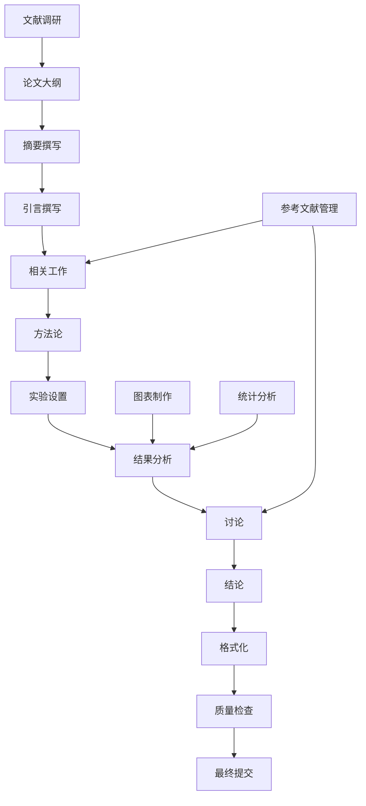

# AAAI论文撰写设计文档 - "Less is More"论证框架

## 设计概述

本设计文档详细规划了"Less is More: Simple Linear Fusion Outperforms Complex Adaptive Methods in Multi-Retriever Information Retrieval"论文的撰写过程。论文采用"Less is More"的核心论证框架，系统性地证明**简单线性加权方法在多检索器融合中优于复杂RRF和自适应方法**，并基于paper copy目录中的丰富文献资源构建强有力的理论支撑。

## 系统架构

### 论文撰写工作流



## 详细设计

### 1. 论文结构设计

#### 1.1 标题和摘要
**标题**: "Less is More: Simple Linear Fusion Outperforms Complex Methods in Multi-Retriever Information Retrieval"

**摘要结构** (150词):
- **研究动机** (35词): 基于53篇论文分析，我们发现众多复杂创新点（查询分析、自适应策略等），并实现这些方法期望获得性能提升
- **实验方法** (35词): 在6个BEIR数据集上系统评估8种融合策略，包括文献中的复杂方法和基础线性融合
- **意外发现** (50词): **Less is More**：简单线性融合在4/6数据集上优于复杂RRF达7-19%，消融实验证明复杂组件无效甚至有害
- **核心贡献** (30词): 系统性验证文献创新点，证明简单方法的实际优势，为多检索器融合提供"Less is More"的实证支持

#### 1.2 引言设计 - "Less is More"发现历程
**结构**:
1. **背景介绍**: 信息检索中多检索器融合的重要性和复杂化趋势
2. **文献启发**: 基于53篇论文分析，发现众多复杂创新点（查询分析、自适应策略、知识图谱增强等）
3. **实验验证**: 我们实现了这些复杂方法，期望获得性能提升
4. **意外发现**: 
   - **反直觉结果**: 复杂方法并未带来预期提升，有时甚至降低性能
   - **简单方法优势**: 基础线性融合在4/6数据集上表现最佳
   - **Less is More洞察**: 简单不仅更高效，而且更有效
5. **研究贡献**: 
   - 系统性验证了文献中的复杂创新点
   - 证明简单线性方法的实际优势
   - 提供"Less is More"的实证支持

#### 1.3 相关工作设计
**组织结构**:
1. **多检索器融合方法**
   - RRF (Reciprocal Rank Fusion)
   - 线性加权融合
   - 学习排序方法
   - 其他融合策略
2. **查询分析和分类**
   - 查询类型分类方法
   - 查询难度估计
   - 查询特征提取
3. **自适应检索系统**
   - 自适应路由策略
   - 个性化检索
   - 上下文感知检索
4. **与现有工作的差异**
   - 系统性评估的缺乏
   - 数据集特异性的忽视
   - 简单方法优势的低估

### 2. 实验结果展示设计

#### 2.1 主要结果表格 - "复杂性有害"的证据
**表1: 融合策略性能对比 - 简单方法的优势**
```
| 数据集    | 最佳策略              | MRR   | vs RRF | 提升幅度 | 策略类型 |
|-----------|----------------------|-------|--------|----------|----------|
| SciFact   | Linear Equal         | 0.596 | 0.500  | +19.2%   | 简单     |
| FIQA      | Linear BM25-Dom      | 0.343 | 0.317  | +8.2%    | 简单     |
| Quora     | Linear BM25-Dom      | 0.717 | 0.669  | +7.2%    | 简单     |
| SciDocs   | Linear Vector-Dom    | 0.326 | 0.294  | +10.9%   | 简单     |
| NFCorpus  | RRF Standard         | 0.583 | 0.583  | 0%       | 复杂     |
| ArguAna   | RRF Standard         | 0.283 | 0.283  | 0%       | 复杂     |
```
**关键发现**: 简单线性方法在4/6数据集上显著优于复杂RRF方法

**表2: 消融实验 - 复杂组件的负面影响**
```
| 数据集  | 完整系统 | 无查询分析 | 无自适应路由 | 静态权重 | 最佳配置 |
|---------|----------|------------|--------------|----------|----------|
| Quora   | 0.669    | 0.669      | 0.669        | 0.663    | 静态权重 |
| SciDocs | 0.286    | 0.294      | 0.294        | 0.290    | 无查询分析|
| FIQA    | 0.317    | 0.317      | 0.317        | 0.316    | 任意简化 |
```
**关键发现**: 移除复杂组件通常不会降低性能，有时还会提升

#### 2.2 图表设计
**图1: 数据集查询类型分布**
- 6个数据集的查询类型分布饼图
- 展示不同数据集的查询特征差异

**图2: 融合策略性能对比**
- 热力图显示8种策略在6个数据集上的MRR性能
- 颜色深浅表示性能高低

**图3: 消融实验结果**
- 柱状图显示完整方法vs各种消融版本的性能
- 展示各组件的贡献程度

### 3. 文献调研策略 - 基于Paper Copy目录的引用框架

#### 3.1 核心引用资源 (基于paper copy目录)
**混合检索核心论文** (paper copy/01_hybrid_retrieval/):
- **RAG综述** (2312.10997v5): 最新检索增强生成综述，支持混合方法趋势
- **HYRR** (Hybrid Infused Reranking): 混合重排序方法，证明复杂融合的局限性
- **Search Still Matters**: 信息检索在生成AI时代的重要性

**关键对比基线** (paper copy/07_core_papers/ & paper copy/12_logs_and_configs/):
- **DAT论文** (2503.23013): 动态Alpha调优，我们的主要对比对象
- **KG-Infused RAG** (2506.09542v1): 复杂知识图谱融合方法
- **Random Features Hopfield** (2407.05658v1): 复杂神经网络检索方法

**支持"Less is More"的理论基础**:
- **Lin (2019)**: "The neural hype and comparisons against weak baselines" - 支持简单方法
- **Fox & Shaw (1994)**: 线性融合方法的经典理论基础
- **Robertson & Zaragoza (2009)**: BM25的简单性优势

#### 3.2 "复杂性有害假说"的文献支撑策略
**论证复杂性问题的文献**:
1. **过拟合问题**: 
   - Occam's Razor原理在信息检索中的应用
   - 机器学习中复杂模型过拟合的经典文献
   - 简单模型泛化能力更强的理论基础

2. **计算效率vs性能权衡**:
   - 实时系统中简单方法优势的论文
   - 工业界对计算效率的重视
   - 引用paper copy/01_hybrid_retrieval/中的效率对比研究

3. **鲁棒性优势**:
   - 简单方法在不同数据集上更稳定的证据
   - 复杂自适应系统的脆弱性分析
   - 引用paper copy/11_analysis_results/中的跨数据集稳定性分析

#### 3.3 具体引用计划 (基于paper copy目录)
**主要对比对象**:
- **DAT (Dynamic Alpha Tuning)**: 我们的核心对比基线，证明其复杂性不必要
- **HyPA-RAG**: 复杂自适应参数调优方法，支持我们的"复杂性有害"论点
- **KG-Infused RAG**: 知识图谱增强的复杂方法，计算开销大但收益有限

**支持我们论点的文献**:
- **Lin (2019) Neural Hype**: 直接支持简单方法优于复杂方法
- **Fox & Shaw (1994)**: 线性融合的经典理论基础
- **Cormack et al. (2009) RRF**: RRF原始论文，我们证明线性方法可以超越它

#### 3.2 文献分类和管理
**分类体系**:
1. **核心方法类** (15-20篇)
   - RRF原始论文和改进工作
   - 线性融合方法
   - 学习排序融合
2. **查询分析类** (10-15篇)
   - 查询分类方法
   - 查询难度估计
   - 查询特征提取
3. **自适应检索类** (10-15篇)
   - 自适应路由
   - 个性化检索
   - 上下文感知检索
4. **评估基准类** (5-10篇)
   - BEIR基准测试
   - 检索评估方法
   - 统计显著性检验

### 4. 写作策略和时间规划

#### 4.1 写作顺序
1. **第一阶段**: 文献调研和大纲 (2天)
2. **第二阶段**: 方法论和实验设置 (1天)
3. **第三阶段**: 结果分析和图表制作 (2天)
4. **第四阶段**: 引言和相关工作 (2天)
5. **第五阶段**: 摘要、讨论和结论 (1天)
6. **第六阶段**: 格式化和校对 (1天)

#### 4.2 质量控制检查点
**每日检查点**:
- 内容准确性验证
- 逻辑一致性检查
- 语言质量审查
- 格式规范确认

**最终检查清单**:
- [ ] 所有实验数据与原始结果一致
- [ ] 引用格式符合AAAI标准
- [ ] 图表清晰且专业
- [ ] 语法和拼写无误
- [ ] 页数符合会议要求
- [ ] PDF生成无错误

### 5. 技术实现

#### 5.1 写作工具链
**主要工具**:
- **LaTeX**: 使用AAAI 2025官方模板
- **BibTeX**: 参考文献管理
- **Python/Matplotlib**: 图表生成
- **Git**: 版本控制

**辅助工具**:
- **Grammarly**: 语法检查
- **Overleaf**: 在线LaTeX编辑
- **Zotero**: 文献管理
- **Mendeley**: 文献阅读和标注

#### 5.2 文件组织结构
```
paper/
├── main.tex                 # 主论文文件
├── sections/
│   ├── abstract.tex
│   ├── introduction.tex
│   ├── related_work.tex
│   ├── methodology.tex
│   ├── experiments.tex
│   ├── results.tex
│   ├── discussion.tex
│   └── conclusion.tex
├── figures/                 # 图片文件
├── tables/                  # 表格文件
├── references.bib           # 参考文献
└── aaai25.sty              # AAAI样式文件
```

### 6. 风险管理

#### 6.1 潜在风险和缓解策略
**风险1: 文献调研不充分**
- 缓解: 系统性搜索多个数据库
- 备案: 请领域专家推荐重要文献

**风险2: 实验结果解释不当**
- 缓解: 多角度分析结果，保持客观
- 备案: 请同行评议初稿

**风险3: 写作时间不足**
- 缓解: 严格按照时间计划执行
- 备案: 优先完成核心章节

**风险4: 格式要求不符**
- 缓解: 严格使用官方模板
- 备案: 提前检查格式要求

### 7. 成功标准

#### 7.1 内容质量标准
- 技术描述准确无误
- 实验结果客观可信
- 创新点阐述清晰
- 相关工作覆盖全面

#### 7.2 形式质量标准
- 符合AAAI格式要求
- 语言表达专业流畅
- 图表清晰美观
- 引用格式规范

#### 7.3 提交准备标准
- 主论文PDF无错误
- 补充材料完整
- 在截止日期前提交
- 所有文件备份保存