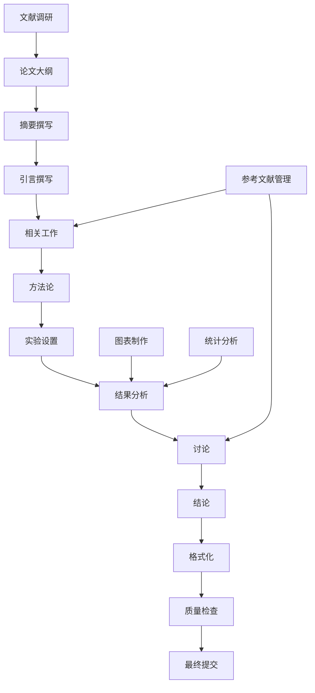

# AAAI论文撰写设计文档

## 设计概述

本设计文档详细规划了"Beyond RRF: A Systematic Study of Multi-Retriever Fusion Strategies for Information Retrieval"论文的撰写过程，包括论文结构、写作策略、文献调研方法和质量保证流程。

## 系统架构

### 论文撰写工作流



## 详细设计

### 1. 论文结构设计

#### 1.1 标题和摘要
**标题**: "Beyond RRF: A Systematic Study of Multi-Retriever Fusion Strategies for Information Retrieval"

**摘要结构** (150词):
- **问题陈述** (30词): 多检索器融合策略选择缺乏系统性研究
- **方法概述** (40词): 在6个BEIR数据集上系统评估8种融合策略，包括RRF、线性加权和自适应方法
- **主要结果** (50词): 简单线性加权方法在多个数据集上优于RRF 7-19%，数据集特异性比查询类型更重要
- **贡献总结** (30词): 提供融合策略选择指导，证明简单方法的稳定性优势

#### 1.2 引言设计
**结构**:
1. **背景介绍**: 信息检索中多检索器系统的重要性
2. **问题动机**: 现有融合方法选择缺乏系统性指导
3. **研究挑战**: 不同数据集和查询类型的最优策略差异
4. **研究贡献**: 
   - 首个系统性的8种融合策略对比研究
   - 发现简单方法优于复杂方法的反直觉结果
   - 证明数据集特异性的重要性
   - 提供实用的策略选择指导

#### 1.3 相关工作设计
**组织结构**:
1. **多检索器融合方法**
   - RRF (Reciprocal Rank Fusion)
   - 线性加权融合
   - 学习排序方法
   - 其他融合策略
2. **查询分析和分类**
   - 查询类型分类方法
   - 查询难度估计
   - 查询特征提取
3. **自适应检索系统**
   - 自适应路由策略
   - 个性化检索
   - 上下文感知检索
4. **与现有工作的差异**
   - 系统性评估的缺乏
   - 数据集特异性的忽视
   - 简单方法优势的低估

### 2. 实验结果展示设计

#### 2.1 主要结果表格
**表1: 基线对比实验结果**
```
| 数据集    | RRF   | LinearEqual | LinearOptimized | 最佳策略 |
|-----------|-------|-------------|-----------------|----------|
| fiqa      | 0.278 | 0.273       | 0.050          | RRF      |
| quora     | 0.702 | 0.700       | 0.146          | RRF      |
| scidocs   | 0.319 | 0.323       | 0.344          | LinearOpt|
| nfcorpus  | 0.649 | 0.642       | 0.642          | RRF      |
| scifact   | 0.717 | 0.736       | 0.704          | LinearEq |
| arguana   | 0.257 | 0.265       | 0.254          | LinearEq |
```

**表2: 融合策略对比结果**
```
| 数据集    | 最佳策略              | MRR   | vs RRF | 提升幅度 |
|-----------|----------------------|-------|--------|----------|
| fiqa      | linear_bm25_dominant | 0.343 | 0.317  | +8%      |
| quora     | linear_bm25_dominant | 0.717 | 0.669  | +7%      |
| scidocs   | linear_vector_dominant| 0.326 | 0.294  | +11%     |
| scifact   | linear_equal         | 0.596 | 0.500  | +19%     |
| arguana   | rrf_standard         | 0.283 | 0.283  | 0%       |
| nfcorpus  | rrf_standard         | 0.583 | 0.583  | 0%       |
```

#### 2.2 图表设计
**图1: 数据集查询类型分布**
- 6个数据集的查询类型分布饼图
- 展示不同数据集的查询特征差异

**图2: 融合策略性能对比**
- 热力图显示8种策略在6个数据集上的MRR性能
- 颜色深浅表示性能高低

**图3: 消融实验结果**
- 柱状图显示完整方法vs各种消融版本的性能
- 展示各组件的贡献程度

### 3. 文献调研策略

#### 3.1 文献搜索策略
**搜索关键词组合**:
- "multi-retriever fusion" + "information retrieval"
- "reciprocal rank fusion" + "RRF"
- "linear combination" + "retrieval fusion"
- "adaptive retrieval" + "query routing"
- "query classification" + "information retrieval"
- "BEIR benchmark" + "retrieval evaluation"

**搜索数据库**:
- ACL Anthology (计算语言学)
- DBLP (计算机科学)
- Google Scholar (综合学术)
- arXiv (预印本)
- ACM Digital Library
- IEEE Xplore

#### 3.2 文献分类和管理
**分类体系**:
1. **核心方法类** (15-20篇)
   - RRF原始论文和改进工作
   - 线性融合方法
   - 学习排序融合
2. **查询分析类** (10-15篇)
   - 查询分类方法
   - 查询难度估计
   - 查询特征提取
3. **自适应检索类** (10-15篇)
   - 自适应路由
   - 个性化检索
   - 上下文感知检索
4. **评估基准类** (5-10篇)
   - BEIR基准测试
   - 检索评估方法
   - 统计显著性检验

### 4. 写作策略和时间规划

#### 4.1 写作顺序
1. **第一阶段**: 文献调研和大纲 (2天)
2. **第二阶段**: 方法论和实验设置 (1天)
3. **第三阶段**: 结果分析和图表制作 (2天)
4. **第四阶段**: 引言和相关工作 (2天)
5. **第五阶段**: 摘要、讨论和结论 (1天)
6. **第六阶段**: 格式化和校对 (1天)

#### 4.2 质量控制检查点
**每日检查点**:
- 内容准确性验证
- 逻辑一致性检查
- 语言质量审查
- 格式规范确认

**最终检查清单**:
- [ ] 所有实验数据与原始结果一致
- [ ] 引用格式符合AAAI标准
- [ ] 图表清晰且专业
- [ ] 语法和拼写无误
- [ ] 页数符合会议要求
- [ ] PDF生成无错误

### 5. 技术实现

#### 5.1 写作工具链
**主要工具**:
- **LaTeX**: 使用AAAI 2025官方模板
- **BibTeX**: 参考文献管理
- **Python/Matplotlib**: 图表生成
- **Git**: 版本控制

**辅助工具**:
- **Grammarly**: 语法检查
- **Overleaf**: 在线LaTeX编辑
- **Zotero**: 文献管理
- **Mendeley**: 文献阅读和标注

#### 5.2 文件组织结构
```
paper/
├── main.tex                 # 主论文文件
├── sections/
│   ├── abstract.tex
│   ├── introduction.tex
│   ├── related_work.tex
│   ├── methodology.tex
│   ├── experiments.tex
│   ├── results.tex
│   ├── discussion.tex
│   └── conclusion.tex
├── figures/                 # 图片文件
├── tables/                  # 表格文件
├── references.bib           # 参考文献
└── aaai25.sty              # AAAI样式文件
```

### 6. 风险管理

#### 6.1 潜在风险和缓解策略
**风险1: 文献调研不充分**
- 缓解: 系统性搜索多个数据库
- 备案: 请领域专家推荐重要文献

**风险2: 实验结果解释不当**
- 缓解: 多角度分析结果，保持客观
- 备案: 请同行评议初稿

**风险3: 写作时间不足**
- 缓解: 严格按照时间计划执行
- 备案: 优先完成核心章节

**风险4: 格式要求不符**
- 缓解: 严格使用官方模板
- 备案: 提前检查格式要求

### 7. 成功标准

#### 7.1 内容质量标准
- 技术描述准确无误
- 实验结果客观可信
- 创新点阐述清晰
- 相关工作覆盖全面

#### 7.2 形式质量标准
- 符合AAAI格式要求
- 语言表达专业流畅
- 图表清晰美观
- 引用格式规范

#### 7.3 提交准备标准
- 主论文PDF无错误
- 补充材料完整
- 在截止日期前提交
- 所有文件备份保存